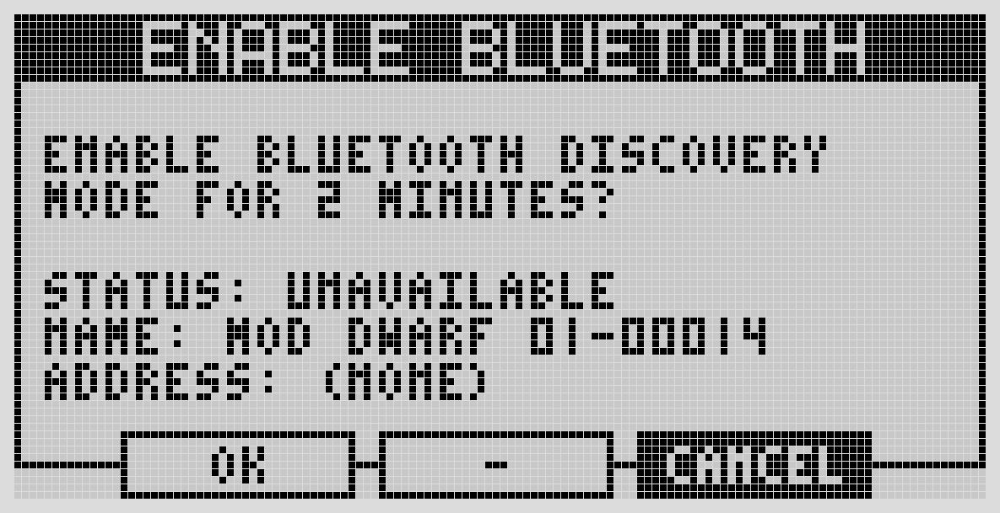
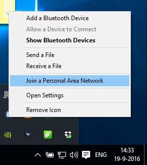
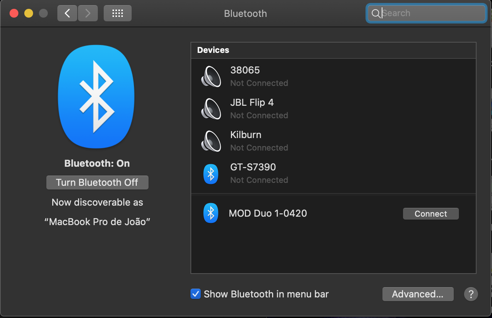
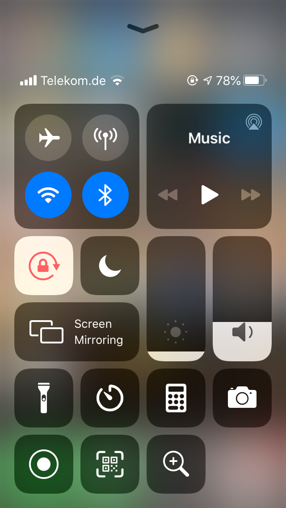
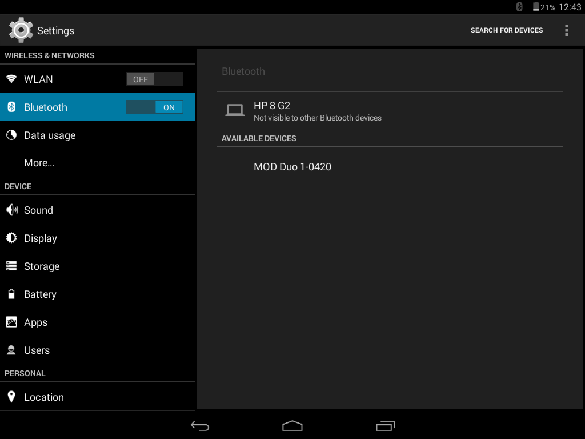

# Bluetooth

The Dwarf has no built-in Bluetooth radio — you need a Bluetooth USB dongle, version 3.0 or higher, plugged into the USB Host port. **Plug the dongle in before powering the Dwarf on.**

## Enabling discovery



From the device: Settings → Bluetooth → enable discovery. This stays discoverable for 2 minutes. The same menu shows your connection status, the device's Bluetooth name (customizable from the Web UI settings), and its Bluetooth MAC address.

## Pairing

Once discovery is on, pair from your computer or mobile device same as any Bluetooth accessory. If prompted for a PIN, use `0000`.






**Windows**: Join a Personal Area Network from the Bluetooth icon, add the device, connect using "Access point." You'll need to re-enable discovery on the Dwarf each time you reconnect.

**macOS**: System Settings → Bluetooth, wait for the Dwarf to appear, connect.

**Linux**: use your distribution's Bluetooth manager to scan, pair, and join the network the Dwarf creates.

**iOS / Android**: enable discovery on the Dwarf, then pair from your device's Bluetooth settings. On Android, you'll also need to explicitly enable "Internet access" through the paired connection — note this disables your phone's normal internet access while connected.

## Once connected

Open a browser and go to:

```
http://192.168.50.1
```

(Note the `.50.1` — different from the `.51.1` used over USB.)

If your dongle isn't recognized, check it's version 3.0+; older or unsupported chipsets will show as "Unsupported" in the Bluetooth status menu.

---

Next: [USB Host Devices](usb-host.md)
