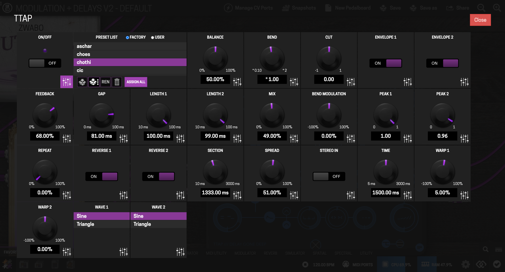
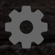
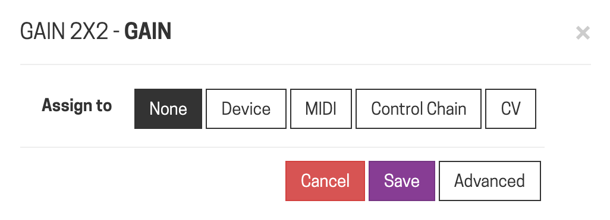
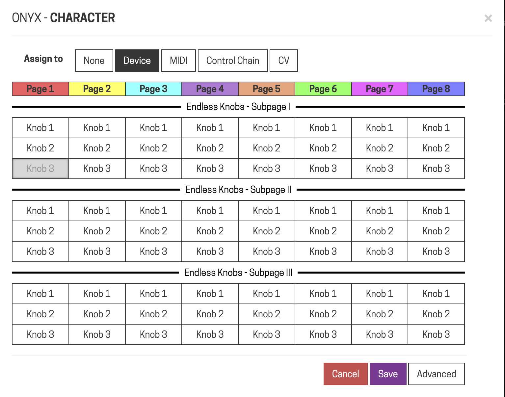
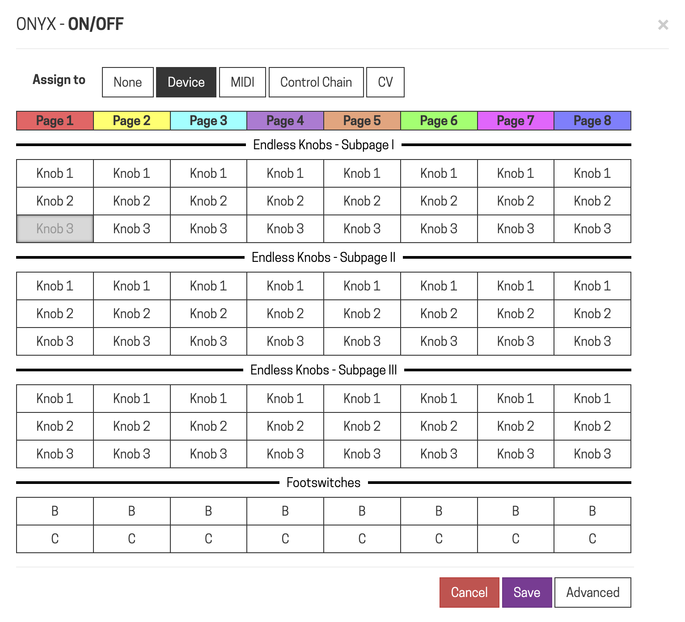
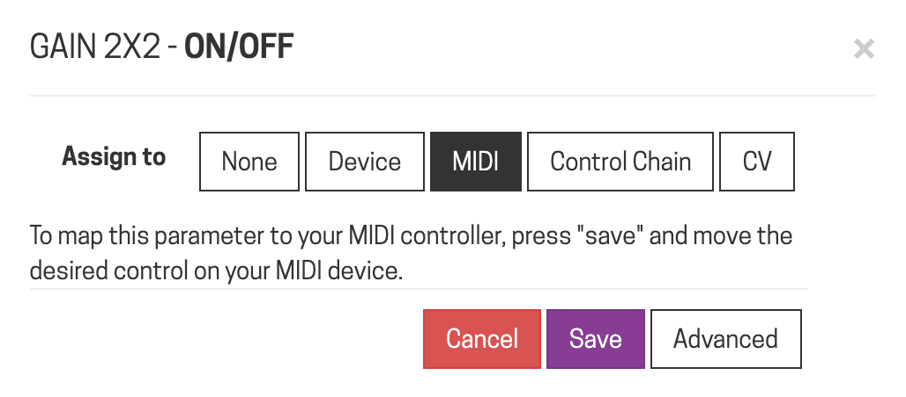
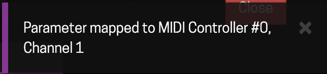
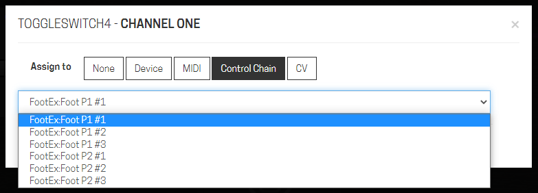
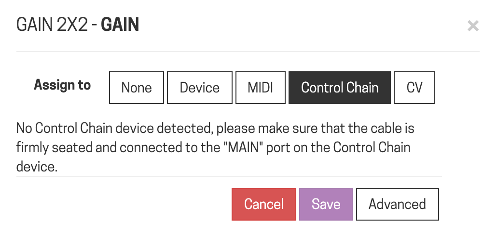
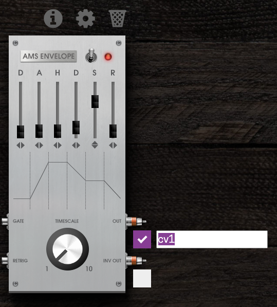

# Assigning Controls

Assigning lets you map a plugin parameter to a physical control — an encoder, a footswitch, a MIDI controller, or a Control Chain device — so you can tweak it live without opening the Web UI.

## Creating an assignment

1. Click the gear icon above the plugin whose parameter you want to assign.
2. Click the assign icon (bottom-right corner of the parameter box). This opens the assignment dialog.

3. Pick the tab for where you want the control to live: **Device**, **MIDI**, **Control Chain**, or **CV**.

Not every parameter can go to every interface type — the dialog only shows valid options for that parameter.

## Assigning to the Dwarf's own controls

Select the **Device** tab. The Dwarf uses a pagination system: 8 main pages, each with 3 encoder sub-pages, so the three encoders can each hold up to 24 parameters and the footswitches up to 8 each.

1. Select the control you want to assign to, and — for encoders — the sub-page.
2. Click Save.

See [Controls Overview](../playing-live/controls-overview.md) for how pages and sub-pages work on the device itself.

## Assigning to a MIDI controller

1. Select the **MIDI** tab and click Save.
2. Move the control on your MIDI controller (turn the knob, press the button) — the assignment locks in as soon as the Dwarf sees the MIDI message.

This works for controllers connected via the MIDI input port or the USB-A host port.

## Assigning to a Control Chain device

Select the **Control Chain** tab and pick the interface from the dropdown. If nothing's listed, no Control Chain device is currently connected.

## Assigning CV

CV assignment is a two-step process:

1. Enable a CV output from a CV-generating plugin already in your pedalboard (click the CV ports button, check the outputs you want, label them).

2. In the target parameter's assignment dialog, select the **CV** tab and pick the labeled output.

For shaping the CV signal itself and driving several parameters from one source, see [Using CV (Control Voltage)](../pedalboards-snapshots/using-cv.md).

---

Next: [Snapshots](snapshots.md)
