# Building a Pedalboard

A pedalboard is your signal chain — the set of plugins and connections that make up a sound or a rig. The Web UI's Constructor view is where you build one.

Note that signal flows **left to right** in the Web UI, opposite to the physical device where audio flows right to left.

## Creating a new pedalboard

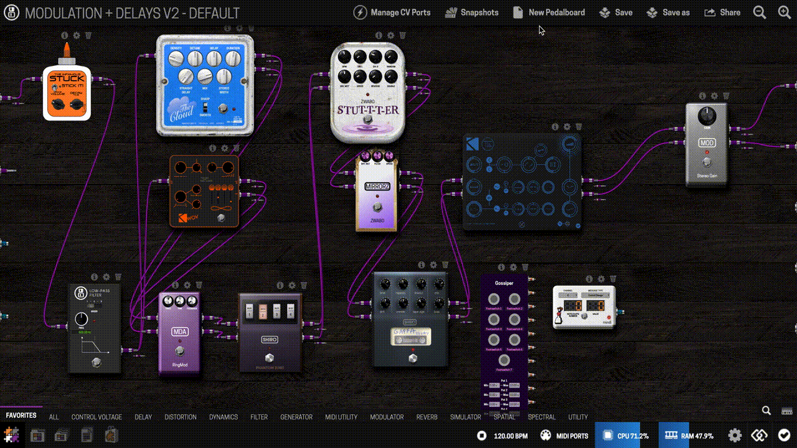

1. Click the "New Pedalboard" button in the Constructor.

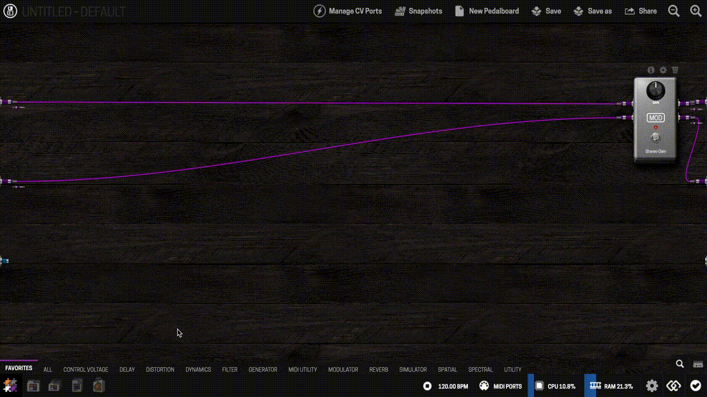

2. Drag plugins from the Plugins Bar (right side) into the pedalboard view.

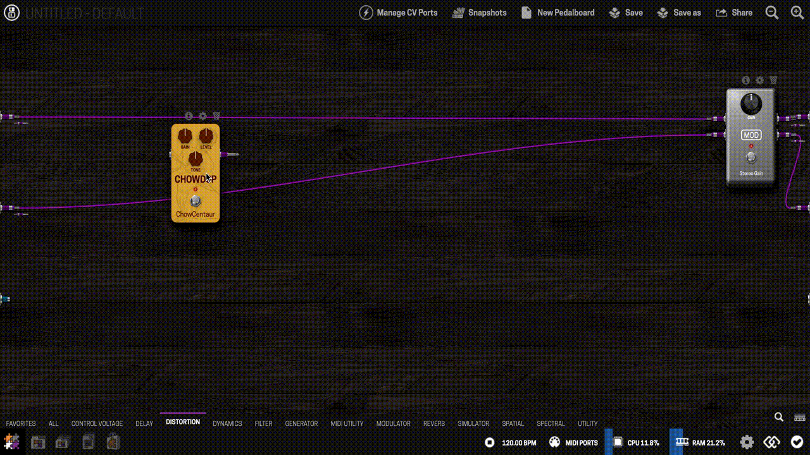

3. Connect plugins by clicking an output node and dragging to an input node.
4. Repeat until your chain is built.

## Cable types

The Web UI uses color to distinguish connection types:

- **Purple** — audio connections, carrying signal between plugins.

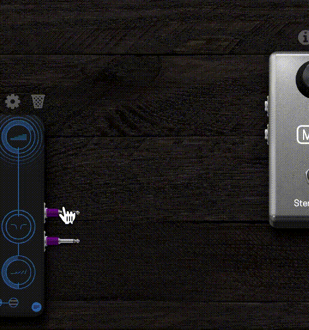

- **Cyan** — MIDI connections.

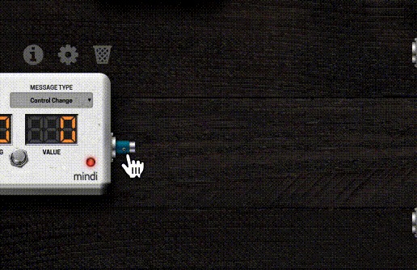

- **Orange** — Control Voltage (CV) connections, for modular-style parameter control. See [Using CV (Control Voltage)](../pedalboards-snapshots/using-cv.md) for what you can do with it.

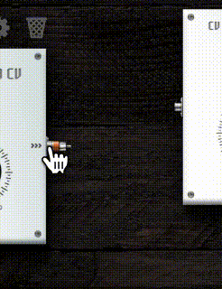

A plugin can have one or two audio inputs/outputs (mono or stereo), and some take mono in but output stereo.

## Gain staging

Use meter plugins (like Level Meter) between stages to check whether a plugin is boosting or cutting your signal more than expected — especially useful after distortion, dynamics, or amp-sim plugins, which can push gain staging further than you'd expect. See [Troubleshooting](../maintaining/troubleshooting.md) if you're dealing with noise or clipping.

## Installing plugins

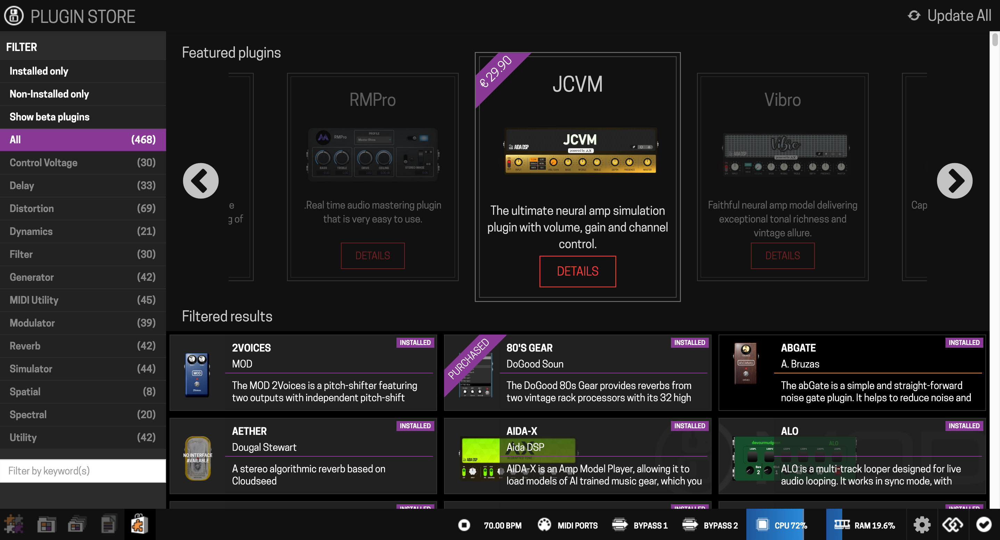

Open the Plugin Store (from the mode selector) to browse or search. Click a plugin, then Install — it's added to your Plugins Bar, ready to drag into a pedalboard.

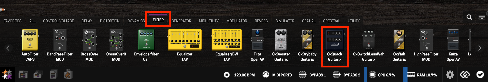

Most plugins are free; paid ones offer a trial (audio will randomly drop out during trial use — that's expected, not a bug) before you buy.

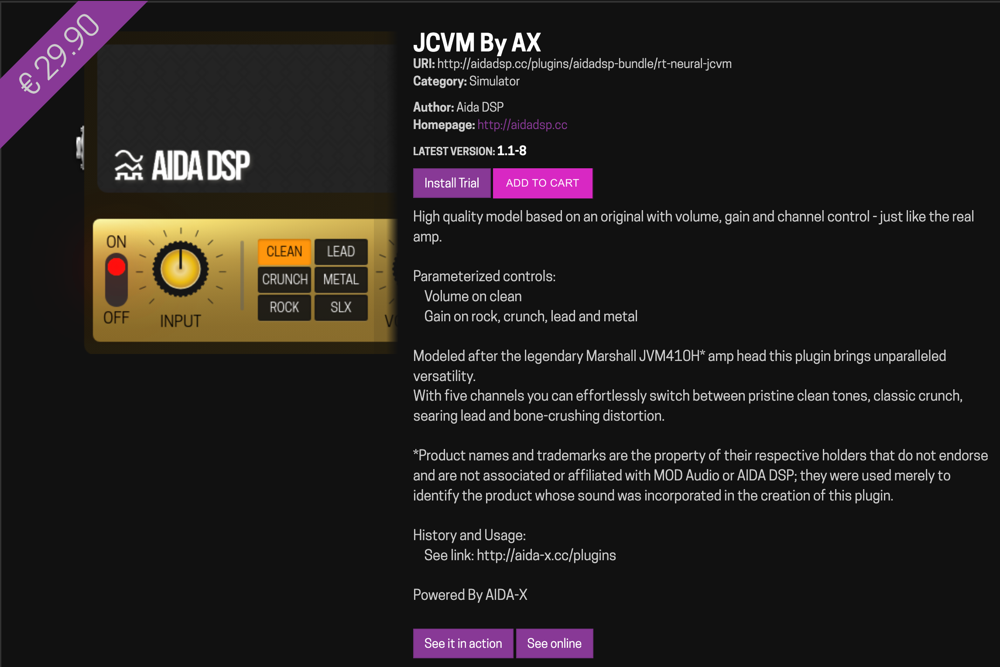

## Saving

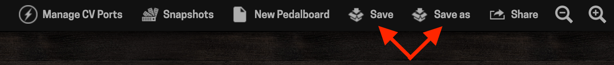

Use **Save** to save over the current pedalboard, or **Save as** to save a new one under a different name. All saved pedalboards appear in the Pedalboards Library.

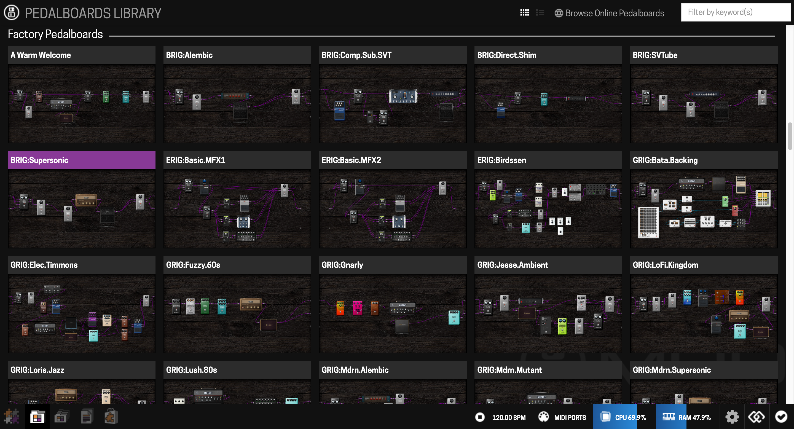

You can also save pedalboards directly from the device — see [Snapshots](snapshots.md).

---

Next: [Assigning Controls](assigning-controls.md)
