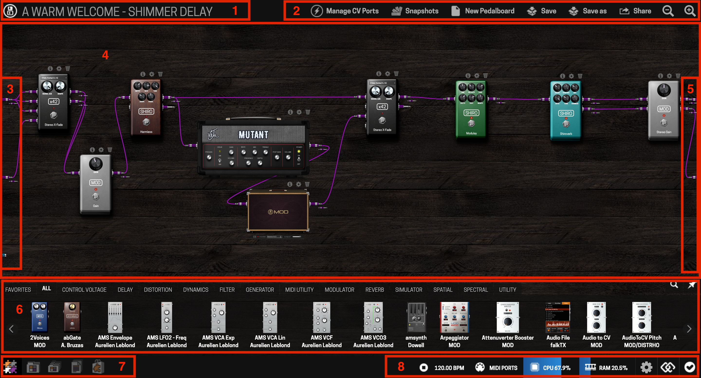
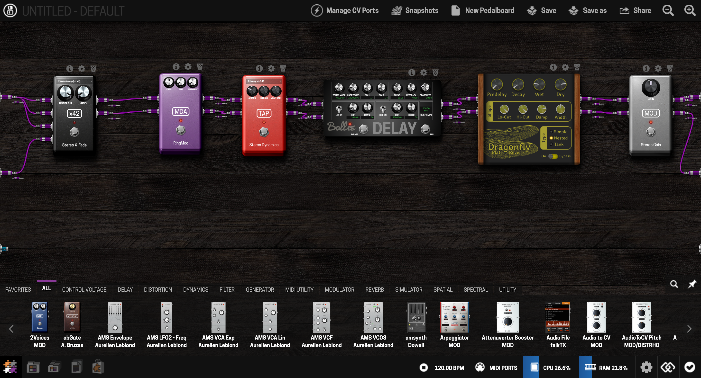

# Accessing the Web UI

The Web UI is where you build and edit pedalboards. It's a browser-based interface served by the Dwarf itself — nothing to install.




## Via USB

Connect the USB cable between the Dwarf's USB-B port and your computer. Your operating system should recognize the Dwarf as a network device automatically. Open a browser and go to:

```
http://moddwarf.local
```

or, if that doesn't resolve:

```
http://192.168.51.1
```

If the connection doesn't come up automatically (this can happen on some Windows versions), see [Troubleshooting](../maintaining/troubleshooting.md).

## Via Bluetooth

The Dwarf doesn't have Bluetooth built in — you'll need a Bluetooth USB dongle (version 3.0 or higher) plugged into the USB Host port. Plug the dongle in *before* powering on the Dwarf, enable Bluetooth discovery from the device's Settings menu, pair it with your computer or mobile device, then browse to:

```
http://192.168.50.1
```

Full pairing steps per operating system are in [Bluetooth](../connecting-gear/bluetooth.md).

---

Next: [Building a Pedalboard](building.md)
