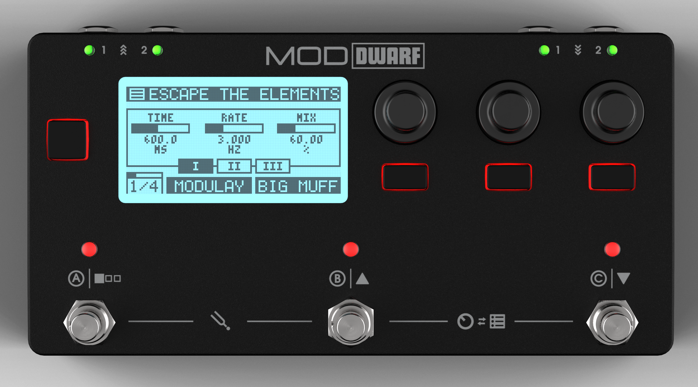
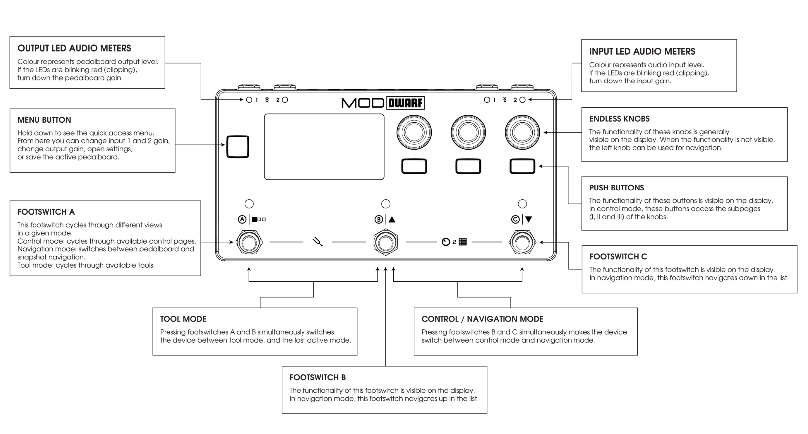
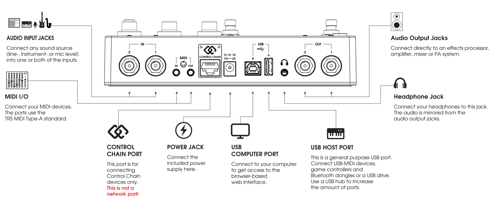

# Connecting Your Dwarf

This covers the essential connections to get sound in and out. For MIDI controllers, expression pedals, and Control Chain devices, see [Connecting Gear](../connecting-gear/midi-expression.md).

## Power

Connect the supplied 12V, 2A power adapter to the Dwarf's power jack. Use only the adapter that came with your unit.

## Audio in

The Dwarf has two independent 6.35mm TRS audio inputs, unbalanced, with configurable input gain per input (-12dB to +35dB). Plug your instrument or line source into either input. You can adjust input gain later from the device menu — see [Audio I/O & Headphone](../settings/audio-io.md).

## Audio out

Two independent 6.35mm TRS audio outputs, balanced or unbalanced, with configurable output gain per output (0dB to -127dB). Connect these to your amp, interface, or monitors.

## Headphones

The 3.5mm TRS headphone output monitors outputs 1 and 2. Volume is adjustable from the device menu.

---

Next: [Powering On & First Sound](first-sound.md)
