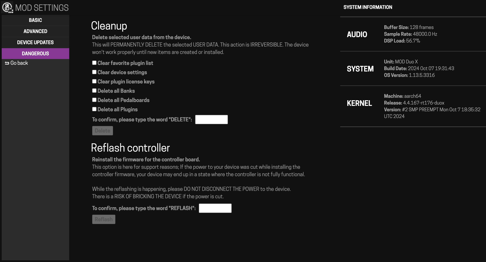
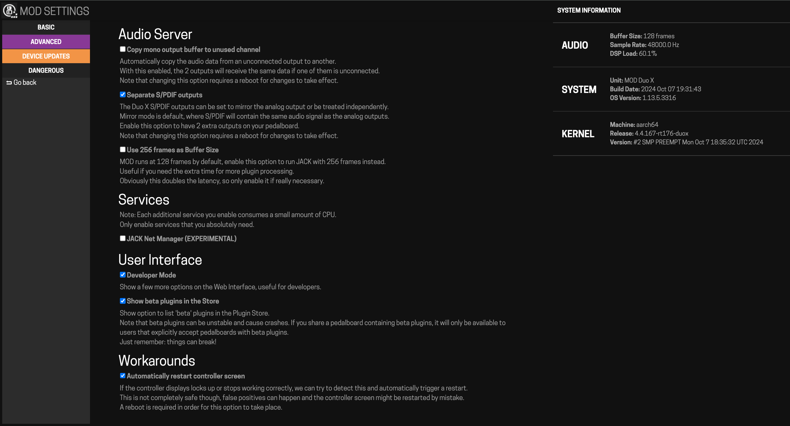

# Factory Reset & Reinstall

The Dwarf is not software-brickable — no matter how badly stuck it gets, it can always be recovered by reinstalling the OS.

!!! warning "Back up first"
    A factory reset erases your data. [Back up](backups.md) to a USB stick before you start. A factory reset does not remove licenses for plugins you've purchased.

## If the device is stuck on the boot logo

Try reflashing the display controller first — this can happen if power was lost mid-update:

- **Via Web UI**: open the advanced settings page (bottom-right of Settings), go to the "Dangerous" section, follow the "Reflash controller" instructions.
- **Via SSH**: connect to `192.168.51.1` (user `root`, password `mod`), run `hmi-update /usr/share/mod/controller/mod*controller.bin`, wait for confirmation, then power-cycle.

## If the device won't boot at all

Force it into recovery mode:

1. Power off.
2. Hold the left-most encoder and the leftmost footswitch.
3. Power on while still holding them.
4. After about 5 seconds, release — the device boots into recovery mode (LEDs turn blue, screen shows "plug USB cable to PC" or similar).

<!-- IMAGE NEEDED: A photo of the device in recovery mode — blue LEDs and the recovery screen
     No wiki source found — needs a fresh photo/screenshot taken during an actual recovery-mode session
     Suggested: docs/assets/maintaining/recovery-mode.png -->
5. Connect to your computer; a mass-storage drive should appear.
6. Download the latest release from the [Releases](https://wiki.mod.audio/wiki/Releases) page.
7. Copy the `mod*.tar` file onto that drive, then safely eject it.
8. Disconnect the USB cable and wait — the device updates and reboots itself.

If the device boots into recovery mode on its own (rather than you forcing it), the same steps 5–8 apply.

## If nothing above works

If the device won't boot even in forced recovery mode, the bootloader itself may need reinstalling — this is a deeper recovery procedure. Contact [support@mod.audio](mailto:support@mod.audio) or the [forum](https://forum.mod.audio) for the current Dwarf-specific bootloader recovery steps.

---

Next: [Reference](../reference/tech-specs.md)
