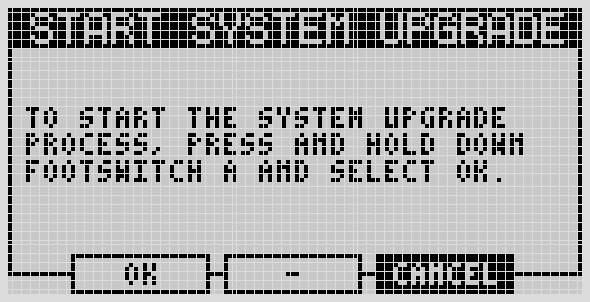

# Installing OS Updates

Regular OS updates are installed through the Web UI, not the device menu.

## From the Web UI (normal path)

<!-- IMAGE NEEDED: The Reboot & Update panel under Web UI Settings → Basic, with the "check for update" / install button
     No exact wiki source found — the wiki shows the parent "Basic" settings page (https://wiki.mod.audio/images/5/56/MODWebGUI_SettingsPage.png, from "MOD Web GUI User Guide") but not a screenshot of the Reboot & Update panel itself; needs a fresh screenshot of that specific panel
     Suggested: docs/assets/maintaining/reboot-update-panel.png -->

1. Open Settings → Reboot & Update.
2. Follow the prompts to check for and install the latest release.
3. The device reboots automatically when done.

Back up first — see [Backing Up Before You Update](backups.md).

## Manual update (maintenance / recovery path)

Use this only if the Web UI update path isn't available. From the device: Settings → System Upgrade. This is intended for maintenance situations; in normal use, updates go through the Web UI.

If the device gets stuck mid-update or won't boot afterward, see [Factory Reset & Reinstall](factory-reset.md) — the Dwarf can always be reinstalled, it isn't software-brickable.

## Trying a test release

Release candidates go out to testers before each final release, installed the way described
here.

!!! info "New in 1.14"
    The test-release program started with the 1.14 candidates, published on the MOD forum in
    September 2026 — on 1.13.5 and earlier, there was no way to try a release before it went
    stable.

Test releases are announced on the MOD forum and by email. Each one has its own forum topic
with the download links and checksums. You install it by hand:

1. Make sure the Dwarf is already on **1.13.5** — earlier versions cannot install a test
   release file. If it is on an older version, install 1.13.5 first from the
   [Releases](https://wiki.mod.audio/wiki/Releases) page (same manual path), then the test
   release.
2. Download the file for the Dwarf from the announcement.
3. On the device: Settings → System Upgrade, then copy the file to the Dwarf when it appears
   as a USB drive. This is the same path as any manual update.

If the screen briefly shows **"invalid file"** and then goes back to asking for the file to be
copied, the Dwarf is on a version older than 1.13.5. Nothing has been changed on the device —
install 1.13.5 first, then try again.

A test release does not show up in Settings → Reboot & Update on its own: that panel only
offers the stable release. The "Report a problem" button in the Web UI opens the test
release's forum topic with your device details ready to paste.

Going back is the same manual install with the current stable image (1.13.5). The Dwarf
accepts an older image without complaint. Back up first either way — see
[Backing Up Before You Update](backups.md).

---

Next: [Backing Up Before You Update](backups.md)
