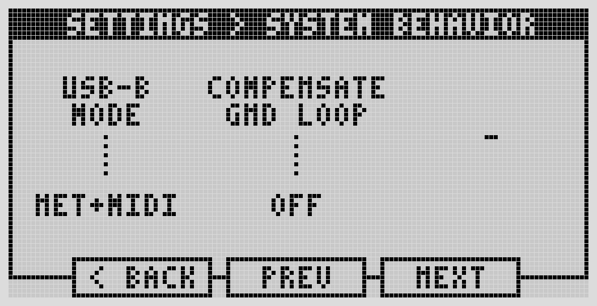

# Troubleshooting

## Power

If the Dwarf won't boot or is acting erratically: confirm the power adapter is properly seated, the power jack isn't damaged or loose, and you're using the supplied adapter (12V, 2A) or an equivalent — see [Technical Specifications](../reference/tech-specs.md). If it's stuck on the boot logo, see [Factory Reset & Reinstall](factory-reset.md).

## Audio

No input or output: check the corresponding LEDs light up, check your cables, and check gain staging on both the Dwarf and whatever's connected to it. Remember inputs/outputs are mirrored between the physical device (inputs right, outputs left) and the Web UI (inputs left, outputs right).

- **No input, no LED**: check [input gain](../settings/audio-io.md).
- **No output, no LED**: make sure your pedalboard actually connects to the output ports, try loading a factory pedalboard to isolate the issue, check you're not running a trial plugin that's dropping audio, check CPU/RAM isn't maxed out, check output gain.
- **No headphone audio**: check headphone volume in [Settings](../settings/audio-io.md).

## USB / Web UI access

Can't reach the Web UI: confirm you're on the USB-B port, and try a different USB-B Mode (Settings → System Behavior). If your computer went to sleep while connected, unplug and replug the USB cable — this is a known side effect of USB selective suspend. On Windows or macOS, also try: `http://` not `https://`, a different browser, checking for firewall blocks, a different cable, or a different computer.

## MIDI

- **Controller not recognized**: verify it's sending data (use a MIDI monitor), check it's listed under MIDI ports setup, try a different cable.
- **Can't make an assignment**: confirm the connection, and that the controller is sending MIDI CC messages (not just notes) for the parameter you're trying to control.
- **Can't input MIDI via the physical ports**: the Dwarf uses TRS Type-A MIDI — make sure any DIN adapter you're using is Type-A, not Type-B.

## Control Chain

If a connected device's assignments aren't showing: confirm something is actually assigned to it, that you saved the pedalboard after assigning, and try reconnecting the cable.

## Noise and gain staging

If you're getting noise when connecting the Dwarf to other gear, it may be a ground loop — try powering everything from the same outlet, or disconnecting from your computer's USB if that's part of the chain. For everyday "too hot" or "too cold" signal issues, use a meter plugin in your pedalboard to find where the level is off, and adjust gain at that stage rather than at the very end of the chain. Keep output LEDs green, occasionally yellow, never red.

## High CPU / RAM usage

Keep CPU usage under 80% to avoid audio dropouts (X-runs). If you're running close to the limit: avoid long series chains of plugins (they're all pinned to one CPU core — Portal Sink/Source plugins can split a chain across cores), try reducing buffer size in Advanced Settings, or swap a CPU-heavy plugin (reverbs, delays, amp/IR modeling) for a lighter alternative from the Plugin Store.

## Get help

Community support: [forum.mod.audio](https://forum.mod.audio). Direct support: support@mod.audio.

---

Next: [Factory Reset & Reinstall](factory-reset.md)
