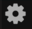

# Backup & Restore

Back up your Dwarf's data to a USB stick, and restore it later — useful before a factory reset or OS update, or just as routine insurance.

By default, a backup includes your banks and pedalboards. You can optionally include device configuration (audio gains, Bluetooth settings, and similar) and your installed plugins.

## Creating a backup

<!-- IMAGE NEEDED: The Backup & Restore panel under Web UI Settings, with the include-checkboxes and "Backup user data..." button
     No exact wiki source found — the wiki shows the parent "Basic" settings page (https://wiki.mod.audio/images/5/56/MODWebGUI_SettingsPage.png, from "MOD Web GUI User Guide") but not a screenshot of the Backup & Restore panel itself; needs a fresh screenshot of that specific panel
     Suggested: docs/assets/pedalboards-snapshots/backup-restore-panel.png -->

1. Insert a USB stick into the USB Host port (A). Use one with enough free space, preferably formatted FAT32.
2. In the Web UI, open Settings → Backup & Restore, and check the boxes for what you want to include.
3. Click "Backup user data..." and wait for it to finish.

## Restoring a backup

1. Insert the USB stick containing the backup into the USB Host port.
2. In Settings → Backup & Restore, check what you want to restore.
3. Click "Restore user data..." and wait for it to finish.
4. You may need to reboot the device for the restored data to take effect.

If the USB stick isn't recognized during backup or restore, see [Troubleshooting](../maintaining/troubleshooting.md).

---

Next: [Using CV (Control Voltage)](using-cv.md)
