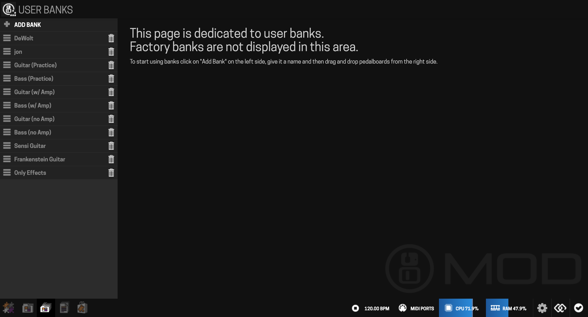
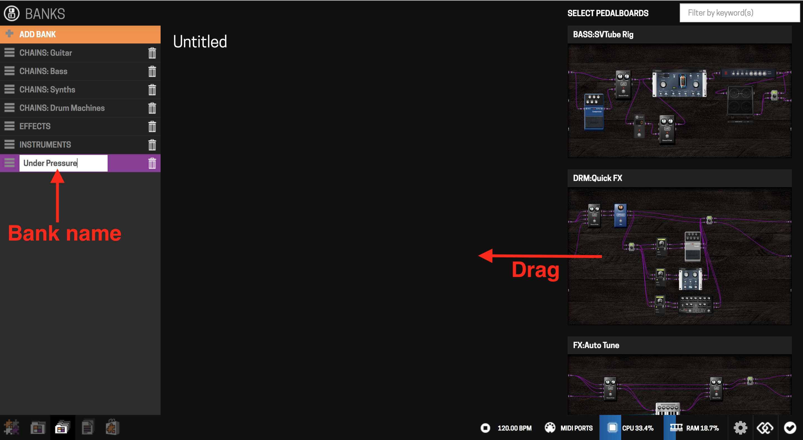

# Organizing Banks

Banks group pedalboards together for quick switching while playing, without the Web UI open. The Dwarf ships with a few factory banks that aren't user-editable; you're encouraged to build your own on top of them.

## From the Web UI

Open the Banks view from the mode selector.

- **Create a bank**: click "Add bank," name it. It starts empty.
- **Populate it**: drag pedalboards from the right-hand panel into the bank. You can add the same pedalboard more than once — handy if you're switching pedalboards via MIDI Program Change messages.

- **Delete a bank**: click the trash icon next to its name in the bank list, confirm. Deleting a bank does not delete the pedalboards inside it. Factory banks aren't listed here and can't be deleted.

## From the device

You can also create banks, and add or remove pedalboards, directly on the Dwarf — see [Navigation Mode](../playing-live/navigation-mode.md) for the full walkthrough.

---

Next: [Managing Snapshots](managing-snapshots.md)
