# Using CV (Control Voltage)

!!! note "Dwarf hardware note"
    The Dwarf has no physical CV input or output jacks — that's a MOD Duo X feature. Everything on this page works fully on the Dwarf anyway, because it's all routed *inside* the pedalboard between plugins. If you want to bring in CV from external modular gear, you'd need an audio-to-CV or MIDI-to-CV converter plugin as the bridge, rather than a direct hardware connection.

CV lets you use one plugin's output to continuously control another plugin's parameter — the same idea as patching a modular synth, just done virtually inside your pedalboard. In the Web UI, CV connections show as **orange cables**, and like any other connection they can be split and merged freely.

The basics of assigning a CV source to a parameter are covered in [Assigning Controls](../first-pedalboard/assigning-controls.md). This page goes further: shaping that signal, and using it to control several things at once.

## What's available

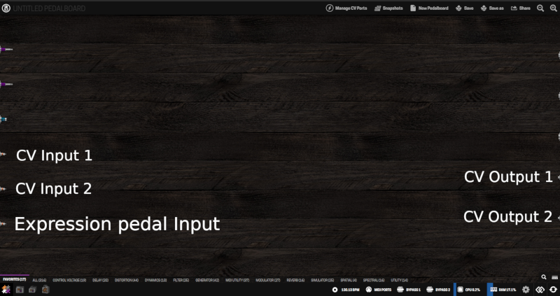

The Plugin Store's Control Voltage category, on the Stable update channel, includes a proper modular toolkit: oscillator, filter, and amplifier (AMS VCO3, VCF, VCA Lin/Exp), envelope and LFO sources (AMS Envelope, AMS LFO2 - Freq, dm-LFO), converters (Audio to CV, Audio to CV Pitch, MIDI to CV mono/Poly), and a set of MOD-built utilities for shaping, routing, and triggering CV (Parameter Modulation, Attenuverter Booster, Random Generator, Slew Rate Limiter, Round, ABS, Logic Operators, Range Divider, Switchbox, Multi Button to CV, CV Gate, CV Clock, Control to CV, CV meter). The full build-a-voice walkthrough is in [Modular Synth Basics](modular-synth-basics.md).

Not everything you might see referenced (in the wider AMS suite this ships from, or elsewhere) is on Stable — a sequencer, Sample&Hold, and most of the rest of that ~65-module bundle aren't confirmed available. See [Confirming Stable availability](modular-synth-basics.md#confirming-stable-availability) before adding anything beyond what's listed above.

## Enabling and assigning a CV source

1. Click **Manage CV Ports** at the top of the Constructor. Every CV output on every CV plugin in your pedalboard gets a checkbox.

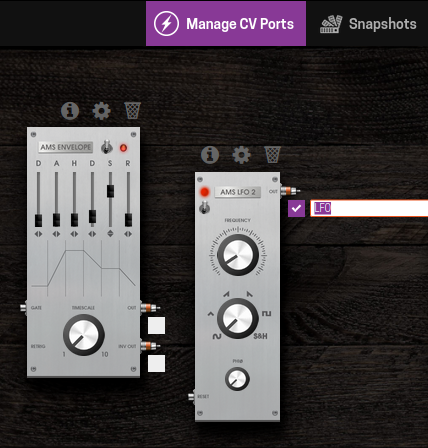

2. Check the output you want to use as a source (for example, an LFO's wave output), and give it a name — this is what you'll see later when assigning it.
3. Open the target parameter's assignment dialog (same gear-icon → assign-icon flow as any other assignment) and select the **CV** tab. Your enabled, named CV source appears in the list — pick it.

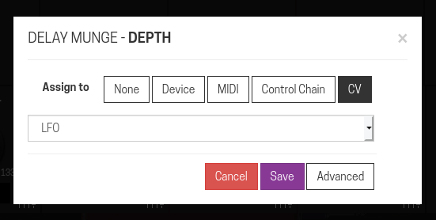
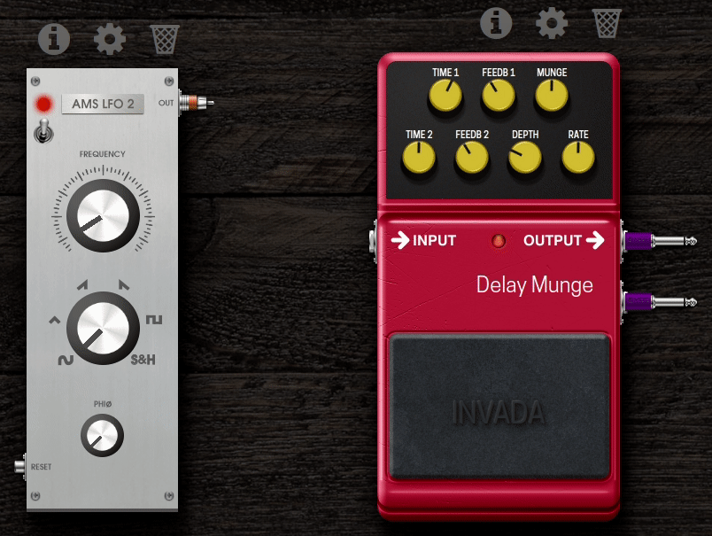

That parameter now moves in response to the CV source in real time.

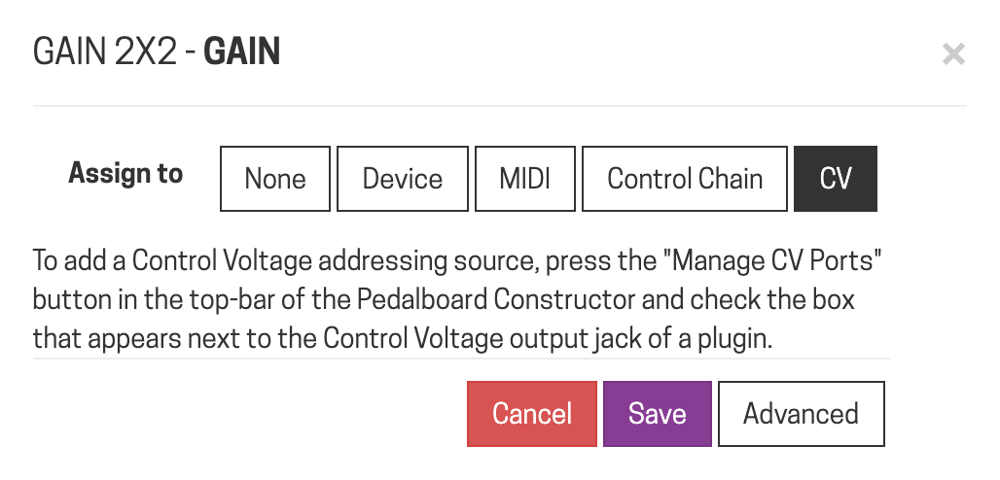
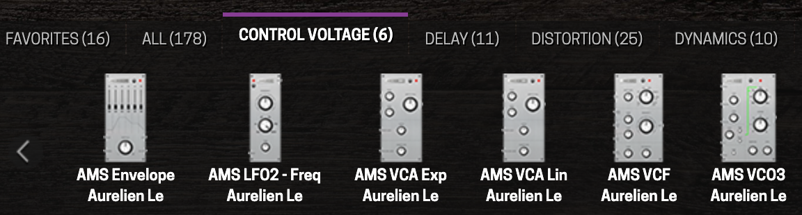
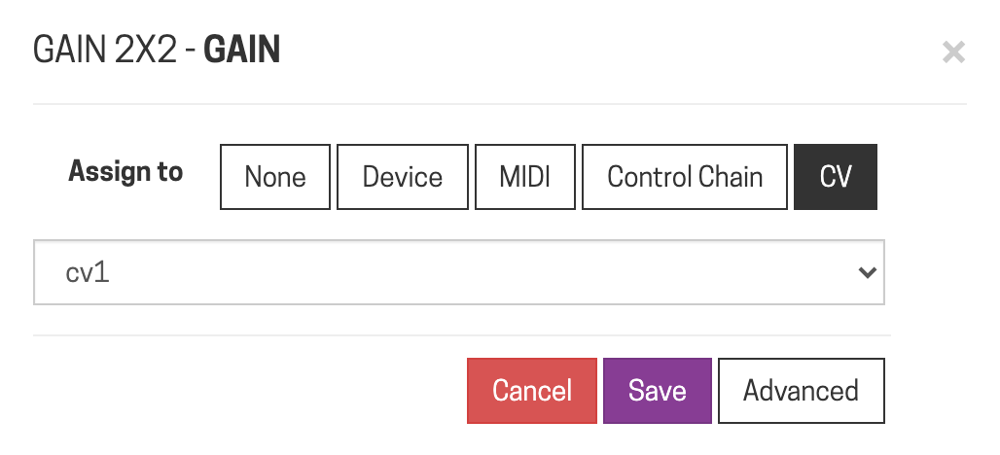

### Advanced settings

Inside the same assignment dialog, click **Advanced** for two extra controls:

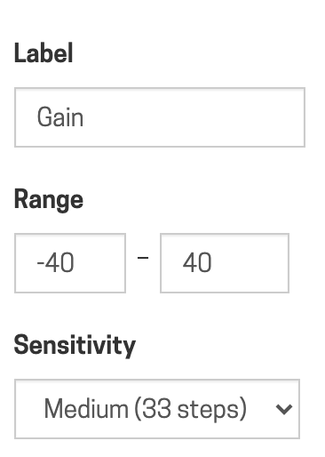
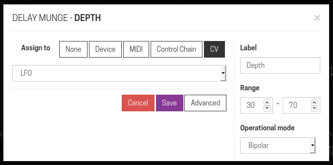

- **Range** — by default the CV source sweeps the parameter's full range; narrow this if you only want it to move within part of that range.

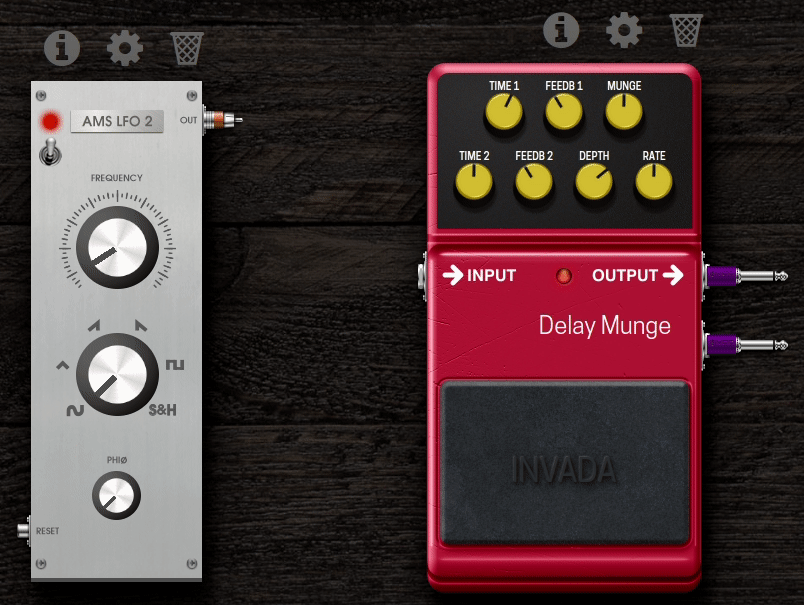

- **Operational mode** — how the parameter interprets incoming CV values. This is auto-detected correctly in most cases; only worth touching for unusual setups.

## CV Parameter Modulation

Typing exact range numbers into the Advanced dialog works, but it's slow and not very musical to tweak live. The **CV Parameter Modulation** plugin solves this: patch your CV source into it, enable *its* output instead of the source's, and assign that to your target parameter. It exposes two controls of its own:

- **PARAMETER** — the parameter's base value before any modulation is applied.
- **MOD. DEPTH** — how much the incoming CV signal pushes the parameter away from that base value. At zero, the output just equals PARAMETER with no movement.

Because PARAMETER and MOD. DEPTH are themselves plugin parameters, you can assign them to physical encoders — so you can dial in a center value and modulation amount live, from the device, without opening the Web UI.

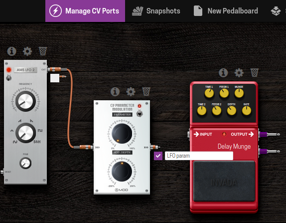
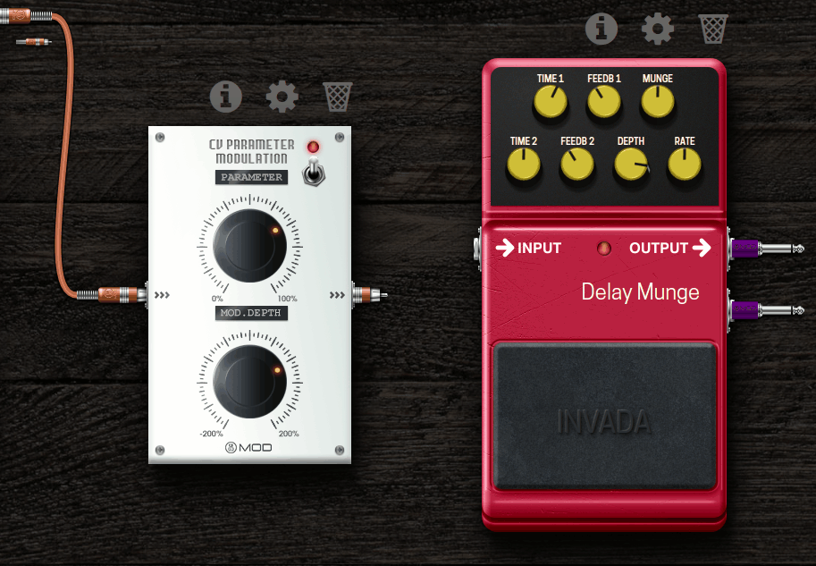
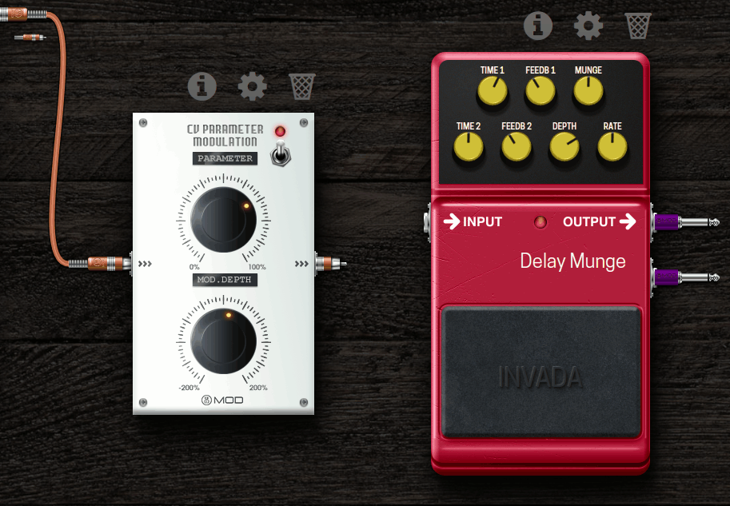

## Macro controls

To control several parameters across several plugins from a single knob, use the **MOD Control to CV** plugin as a macro source:

1. Add **Control to CV** to your pedalboard and enable its CV output.

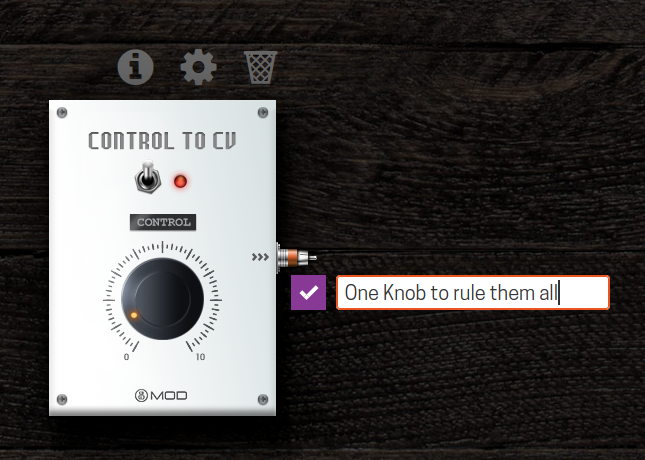

2. Assign that output to every parameter (in any plugin) you want the macro to control.

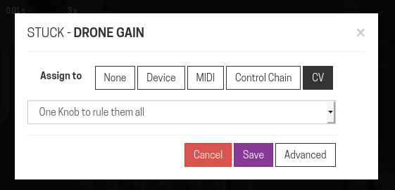
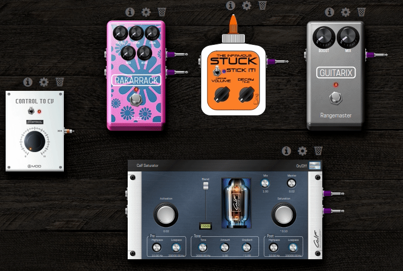

Turning the Control to CV plugin's own knob now moves all of them together. You can assign that knob to a physical encoder or footswitch for hands-on macro control, and you can add as many Control to CV plugins as you like, each driving a different group of parameters.

Off means zero, not "no change": turning off a Control to CV plugin makes it broadcast zero rather than leaving assigned parameters where they were — everything it's driving will drop to its minimum. Keep that in mind before bypassing one mid-performance.

One practical use: pairing two mono plugin instances (say, two instances of a mono drive pedal) and using two Control to CV plugins to keep a stereo pair's controls locked together, since the plugin itself has no native stereo mode.

---

Next: [Modular Synth Basics](modular-synth-basics.md)
