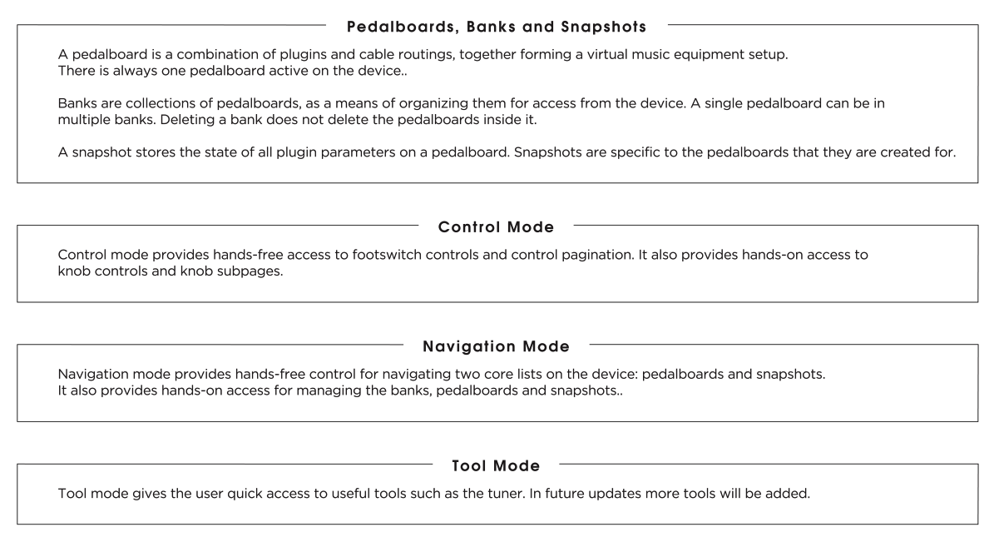
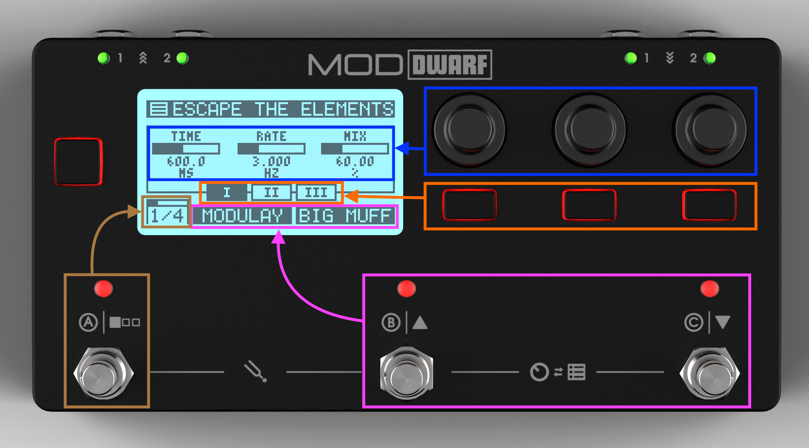

# Device Concepts & Modes

The Dwarf has three modes, each suited to a different part of using the device.

- **Control Mode** — the default mode. Play and tweak pre-mapped parameters from your loaded pedalboard using the encoders and footswitches.
- **Navigation Mode** — browse and load pedalboards, snapshots, and banks.
- **Tool Mode** — access the built-in tuner and tempo tools.

You move between them with footswitch combinations rather than a menu, so switching stays fast during a performance — see [Controls Overview](controls-overview.md) for exactly which combination does what.

## Control Mode

Control Mode is what you see on boot. The display header shows the current pedalboard or snapshot name (you choose which in [Settings](../settings/audio-io.md)); below it, the parameters currently mapped to the three encoders for the active page and sub-page.

The Dwarf supports 8 assignment pages, each with 3 encoder sub-pages — so the three encoders can hold up to 24 parameters each, and the two assignable footswitches up to 8 each. Footswitch A cycles between the 8 pages (press to go forward, long-press to go back); the three push buttons under the encoders switch sub-pages.

## Navigation Mode

Covered in full on [Navigation Mode](navigation-mode.md). Note you can only enter Navigation Mode if the Web UI isn't currently open on the device.

## Tool Mode

Covered in full on [Tool Mode — Tuner & Tempo](tool-mode.md).

---

Next: [Controls Overview](controls-overview.md)
