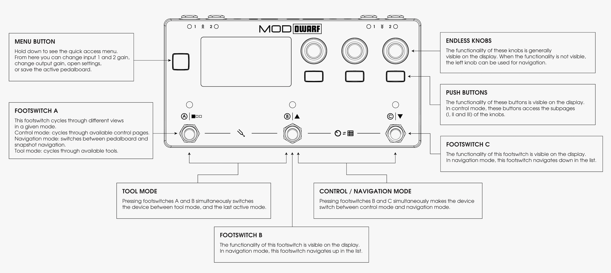
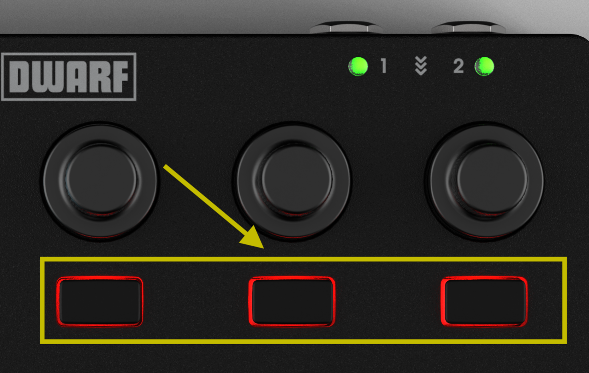
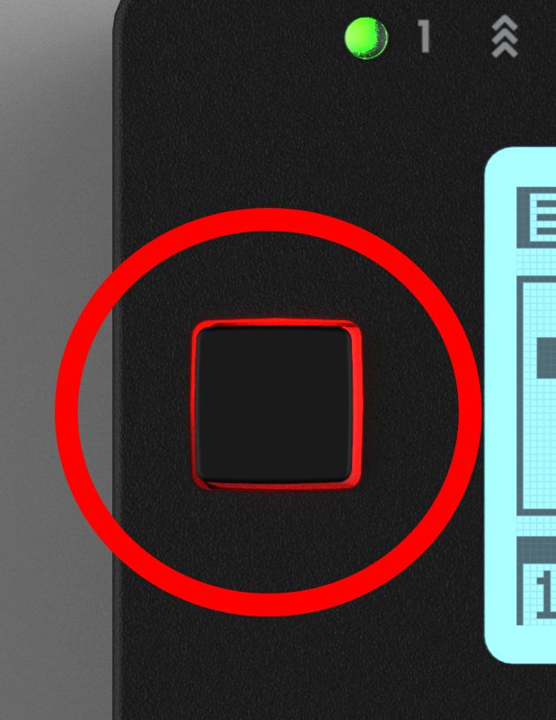
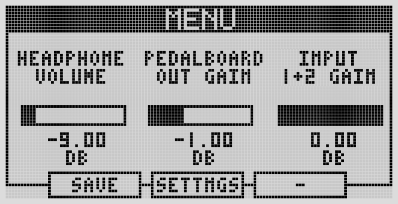
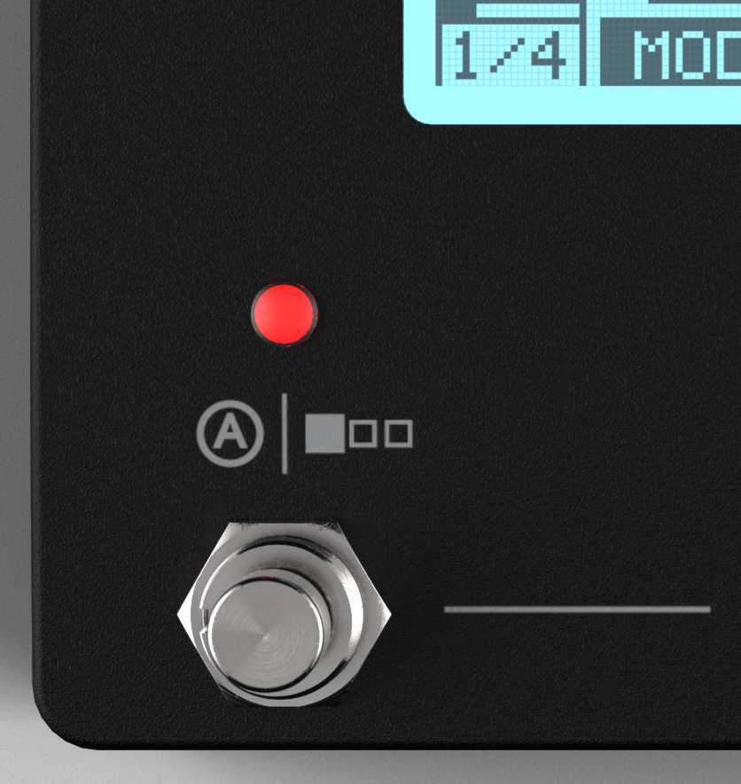

# Controls Overview

## Encoders

The three endless knobs each behave differently depending on what's assigned to them:

- **Knob** — turn for a precise change, hold and turn for a coarse change.
- **Trigger** — turn left, turn right, or click to trigger.
- **Toggle** — turn left for off, right for on, or click to toggle.
- **List** — turn to open the list and step through it; click to open/close the overlay; hold, turn, then release to browse and immediately apply a value.

Some parameters can also be pushed for a full-screen view of the value or list.

## Push buttons

The three rectangular buttons under the encoders switch between the three encoder sub-pages in Control Mode, and perform the on-screen actions shown in Navigation Mode, the device menu, or Settings.

## Menu button

To the left of the display. Opens the quick menu, where you can save pedalboards and snapshots, jump into [Settings](../settings/audio-io.md), or adjust up to three parameters you've defined as Menu Items.

## Display

2.9" LCD. Shows live control mapping in Control Mode, plus menus and tools when active.

## Footswitches

Three footswitches (A, B, C), each context-dependent:

**Footswitch A**

- Control Mode: cycles between the 8 assignment pages.
- Navigation Mode: cycles between the pedalboards and snapshots lists.
- Tool Mode: cycles between tools.
- Pressed with footswitch B: enters Tool Mode.

Footswitch A can't itself be assigned to a plugin parameter.

**Footswitches B & C**

- Control Mode: control whatever parameters the pedalboard creator mapped to them (up to 8 each via pagination), and — when mapped together — step up/down through list-based parameters.
- Navigation Mode: B steps up, C steps down the active list.
- Tool Mode: functions shown on screen, specific to the active tool.
- Pressed together: enters Navigation Mode.

## LED audio meters

Each input and output has an LED that reflects signal level — see [LED Meters](led-meters.md).

---

Next: [Navigation Mode](navigation-mode.md)
