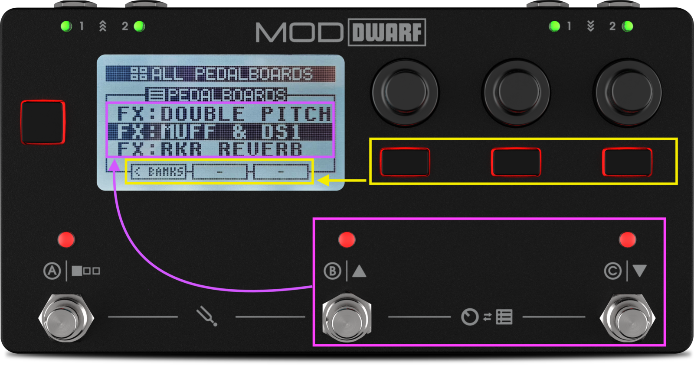
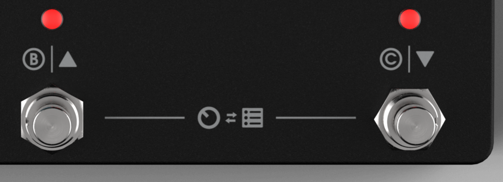
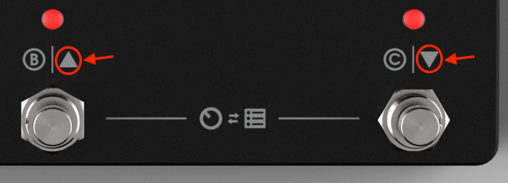
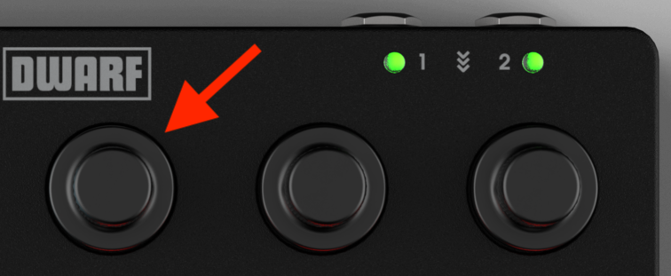
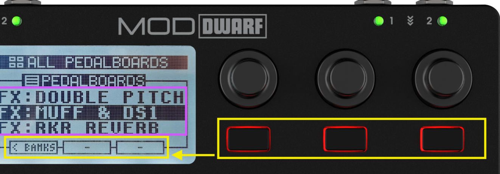

# Navigation Mode

Navigation Mode is how you browse pedalboards, snapshots, and banks directly from the device — no Web UI needed. (In fact, you can only enter Navigation Mode when the Web UI isn't open.)

## Getting in and around

Press footswitches B and C together to enter. Press footswitch A to switch between the pedalboards list and the snapshots list for the currently loaded pedalboard.

To scroll: footswitch B moves up the list, footswitch C moves down — and loads each item as you land on it. If you'd rather browse without loading, turn the left-most encoder instead; the currently loaded item is marked with a small triangle. Press the encoder to load whatever you've scrolled to.

## Banks

Banks group pedalboards for quick switching while the device is disconnected from the Web UI.

**Opening the Banks list**: from the pedalboards view, press the left-most button ("< BANKS"). Turn the left-most encoder to scroll; the active bank is marked with a triangle. Press "ENTER >" or the encoder to open a bank — note that opening a bank doesn't activate it; loading a pedalboard from inside it does.

**Creating a bank**: from the Banks window, press the center button ("NEW"), type a name, press "Save."

**Adding pedalboards to a bank**: from an empty bank, jump straight to "ADD PB TO BANK." From a populated one, scroll to the top of the list and turn further to reach "ADD PB TO BANK," then select the source bank, select the pedalboards (or whole banks) you want with the center "SELECT" button, and press "ADD." The same pedalboard can be added to a bank multiple times — useful if you're switching pedalboards via MIDI Program Change.

**Deleting a bank**: highlight it and press the right-most button ("DELETE"), then confirm. This doesn't delete the pedalboards inside it. Factory banks and the built-in "All user pedalboards" bank can't be deleted.

## Saving and removing snapshots here

Covered in [Snapshots](../first-pedalboard/snapshots.md) and [Managing Snapshots](../pedalboards-snapshots/managing-snapshots.md).

---

Next: [Tool Mode — Tuner & Tempo](tool-mode.md)
