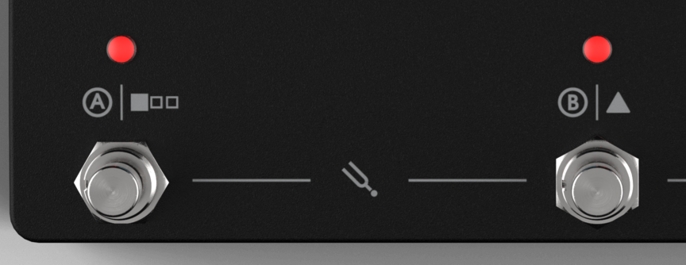
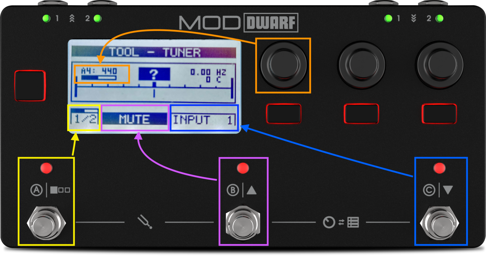
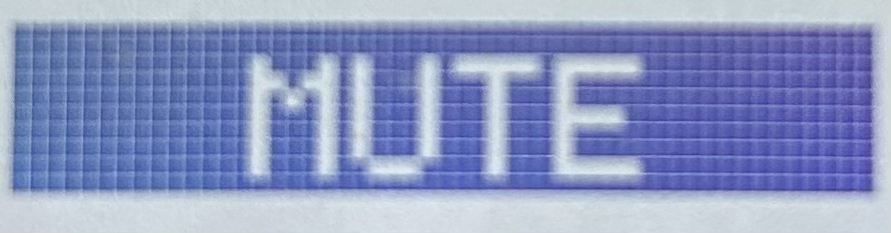
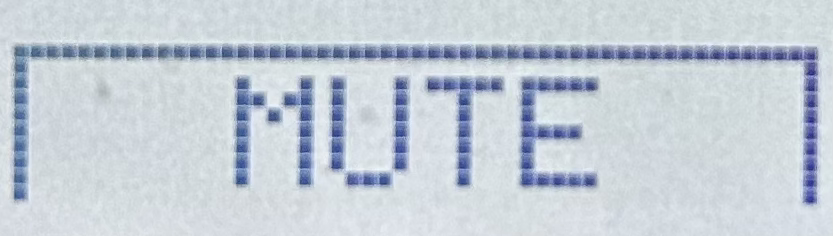
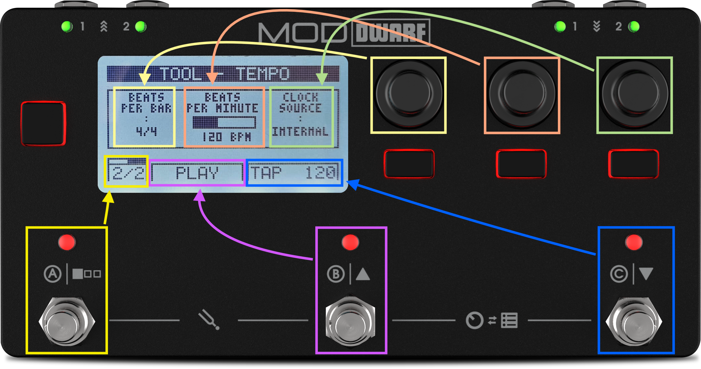

# Tool Mode — Tuner & Tempo

Tool Mode gives you quick access to two built-in utilities: a tuner and a tempo tool.

Press footswitches A and B together to enter. Press footswitch A again to swap between tools. Your default tool (which one shows up first) is set in [Settings](../settings/audio-io.md).

## Tuner

Works off either input. Push footswitch C to switch which one. Push footswitch B to toggle mute-while-tuning on or off — active mute shows as a dark button with light text.

 Turn the left-most encoder to set the reference pitch (427–453 Hz around standard A4 = 440 Hz); a non-default pitch shows with inverted colors. Both settings persist across power cycles.

If you see a question mark instead of a note, the tuner isn't getting signal — check your input selection, cable, and gain.

## Tempo

Sets the device's master tempo.

- **Beats per bar** — left-most encoder, 1 to 16 (denominator isn't adjustable).
- **Beats per minute** — center encoder, 20 to 280, or tap it in with footswitch C (tap tempo).
- **Clock source** — right-most encoder: Internal, MIDI, or Ableton Link. With MIDI selected, tap tempo is disabled and the display shows "synced" instead.
- **Start/stop** — footswitch B toggles the host transport, which drives the system clock. Light background means stopped; dark means running.

---

Next: [LED Meters](led-meters.md)
