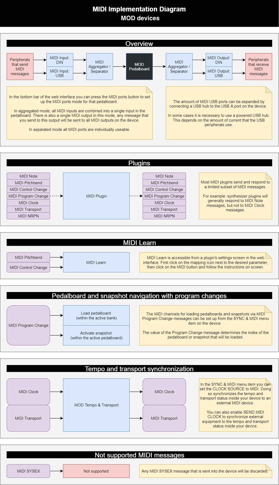

# MIDI Implementation

The full MIDI implementation chart (message types, channels, and behavior) is maintained as a single diagram shared across all MOD devices (MOD Duo, MOD Duo X, and MOD Dwarf), current as of MOD OS 1.13.

!!! note "Image not yet migrated"
    The source diagram lives on the wiki as a single image file rather than text — it needs to be pulled in as an asset for this manual (see the asset pipeline task) rather than recreated by hand, so its content isn't reproduced here yet.

Current version: [MIDI Implementation Diagram](https://wiki.mod.audio/wiki/MIDI_Implementation_Diagram) on the wiki.

---

Next: [Glossary](glossary.md)
