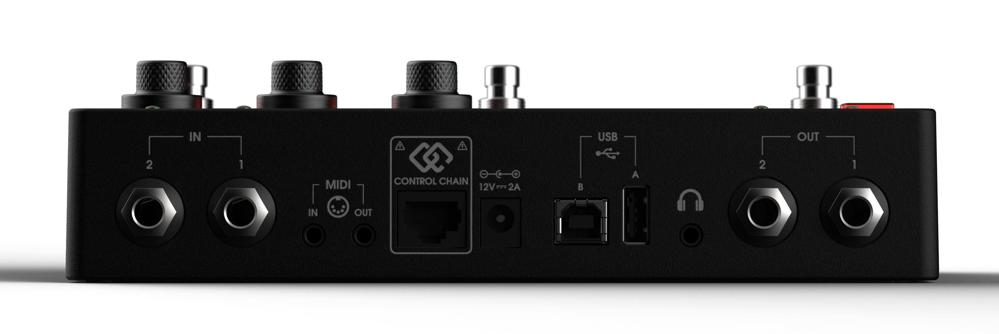

# Technical Specifications

## Dimensions

202 × 105 × 54 mm (W × D × H), 800 g.

## Processor

- RockChip PX30, Cortex-A35, 64-bit, quad-core up to 1.3 GHz
- 1 GB RAM, 8 GB flash storage
- Audio codec: Cirrus Logic CS4265 — 24-bit/192kHz, DAC 104dB dynamic range / -90dB THD+N, ADC 104dB dynamic range / -95dB THD+N

## Audio I/O

- **Inputs**: 2× independent mono, unbalanced TRS, -12dB to +35dB gain in 0.5dB steps, 1MΩ impedance
- **Outputs**: 2× independent mono, balanced TRS, 0dB to -127dB in 0.5dB steps
- **Headphone**: 3.5mm TRS stereo, 2×105mW @ 16Ω, mirrors main outputs, -33dB to +12dB in 3dB steps

## MIDI

3.5mm TRS Type-A MIDI in and out.

## USB

- **Host** (Type-A): USB 2.0, 500mA max output
- **Device** (Type-B): USB 2.0

## Controls

- 2.9" LCD display
- 3× endless encoders
- 3× backlit push buttons
- 1× backlit menu button
- 3× footswitches with LED indicators

## Power

12VDC, 2A, center-positive barrel plug, Φ5.5×2.1×10mm.

## Software

Runs the MOD OS (Dwarf support added in MOD OS 1.10).

---

Next: [MIDI Implementation](midi-implementation.md)
