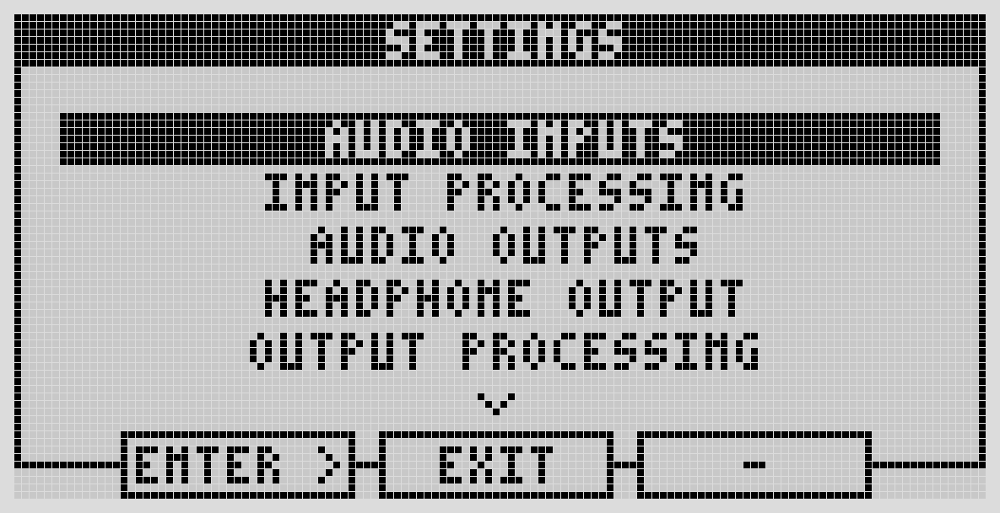
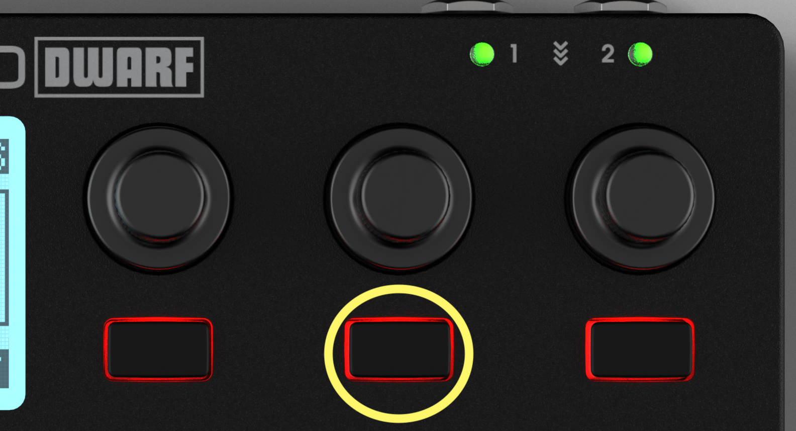
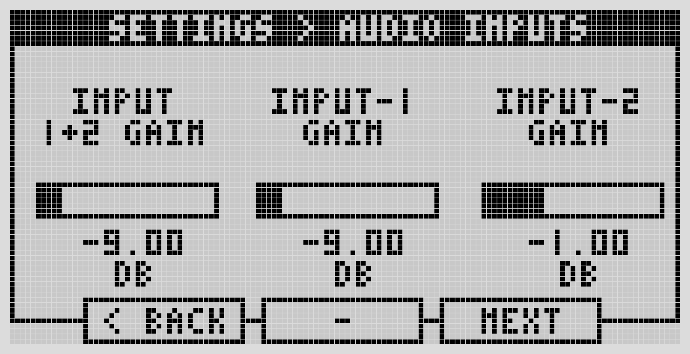
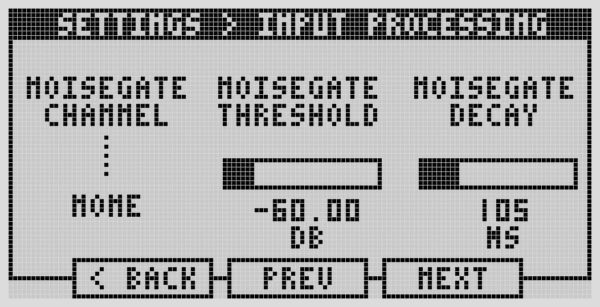
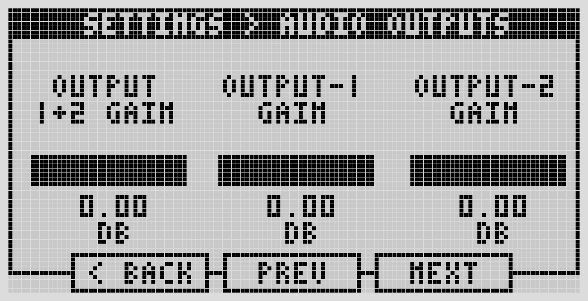
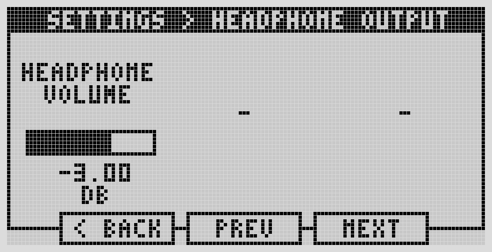
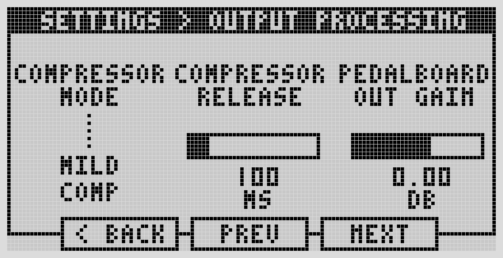

# Audio I/O & Headphone

Reach these from the device: press the Menu button, then the center button, to open Settings. Scroll with the left-most encoder, press it (or the leftmost button) to open a submenu, and press the center button to exit.

## Audio Inputs

Adjustable -12dB to +35dB, in 0.5dB steps.

- Left-most encoder — both inputs together.
- Center encoder — input 1 only.
- Right-most encoder — input 2 only.

Turn for fine adjustment; push-and-turn for coarser steps.

## Input Processing

A built-in noise gate, per input or both simultaneously (or off). Configurable threshold and decay.

## Audio Outputs

Adjustable 0dB to -127dB, in 0.5dB steps, using the same left/center/right encoder pattern as inputs (both / output 1 / output 2).

## Headphone Output

Digital volume, -33dB to +12dB in 3dB steps. Mirrors outputs 1 and 2.

## Output Processing

A built-in compressor with three intensities (light, mild, heavy) or off, plus a configurable release time. This section also sets the pedalboard output gain — the last digital gain stage before the signal goes analog.

---

Next: [MIDI Settings](midi.md)
