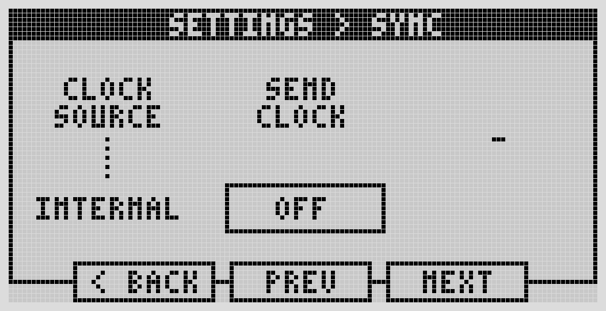
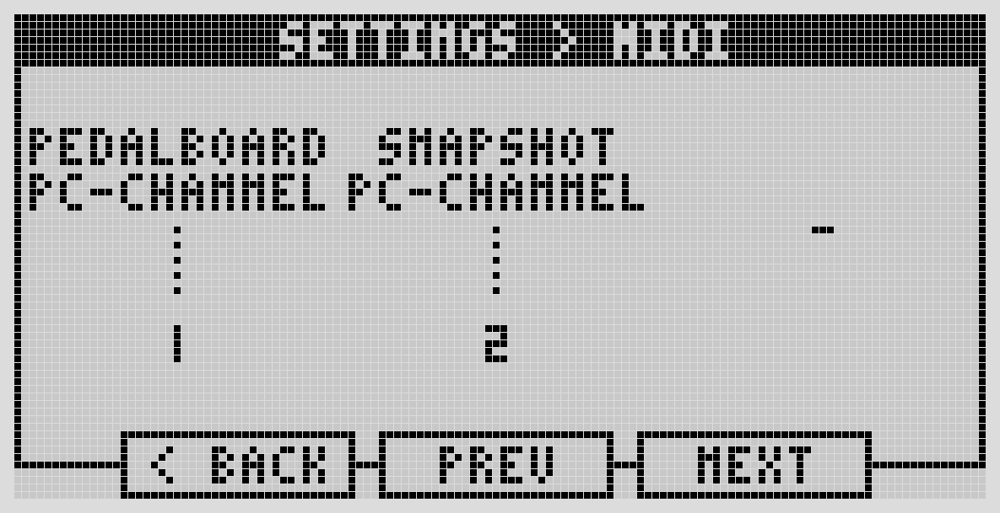

# MIDI Settings

## Sync

Set the device's clock source: Internal, MIDI, or Ableton Link — and whether the Dwarf sends a clock signal out. This is the same clock source selectable from the [Tempo tool](../playing-live/tool-mode.md).

## MIDI

Define the MIDI Program Change channel used to switch pedalboards and snapshots remotely, if you want that behavior.

For general MIDI controller setup and assignment, see [MIDI Controllers & Expression Pedals](../connecting-gear/midi-expression.md) and [Assigning Controls](../first-pedalboard/assigning-controls.md).

---

Next: [Menu Items](menu-items.md)
