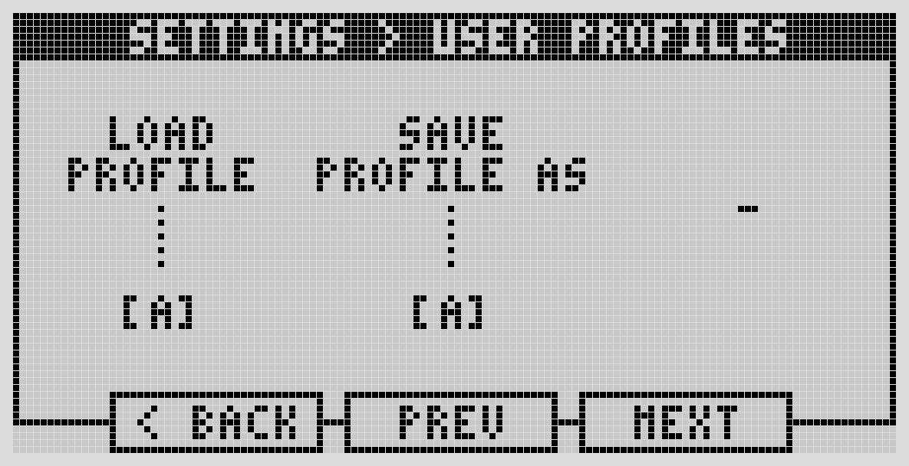

# User Profiles

User Profiles let you save and swap between whole sets of device settings — handy if you use the same Dwarf in different contexts (say, guitar and mic in the studio one day, synth on stage the next) and don't want to re-dial everything by hand each time.

A profile stores: Audio Inputs, Audio Outputs, Headphone Volume, Sync settings, and MIDI settings. You get four profile slots.

## Switching profiles

Turn the left-most encoder to cycle through the four profiles, click it to load the one you land on.

## Saving a profile

1. Change the settings you want saved (Audio, Sync, MIDI, etc.) in their respective menus first.
2. Go to User Profiles.
3. Turn the center encoder to pick which of the four slots to overwrite.
4. Click the center encoder to confirm.

---

Next: [Updating & Maintaining](../maintaining/os-updates.md)
